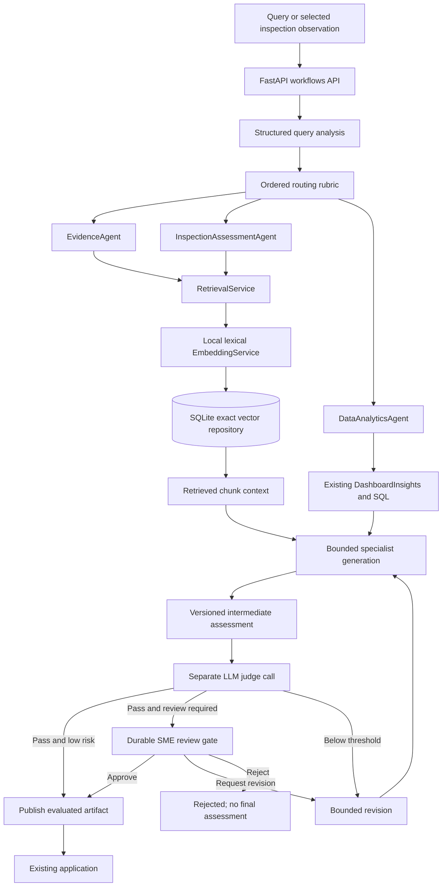

# Agent architecture

Source of truth: this upgraded project, based on RegInsight-AI-Human-Review.zip. Existing routes and styling remain. New workflows are explicitly started; the legacy chatbot does not silently switch pipelines.

## What existed and what changed

| Area | Existing implementation reused | Added implementation |
|---|---|---|
| Application | React experience, FastAPI routers | Collapsed workflow review panel in existing Evidence section |
| Analytics | Typed QueryRequest/QueryPlan, DashboardInsights, deterministic risk | DataAnalyticsAgent calls these services; does not generate SQL |
| Classification | Existing rules/provider adapters, immutable observation snapshots | InspectionAssessmentAgent interprets selected evidence without changing classification |
| Retrieval | Keyword chatbot references, SQL evidence, lexical observation groups | Separate query/document embedding pipeline and persisted exact vector search |
| Review | Append-only website observation decisions | Artifact-specific gate, version checks, approve/revise/reject and durable workflow state |
| Evaluation | Offline deterministic DeepEval contracts | Real separate LLM-judge invocation, rubric thresholds and agent/retrieval smoke dataset |

No LangGraph dependency or autonomous recursive delegation. WorkflowService is the explicit supervisor/state machine. Multi-agent requests are sequential and bounded to DataAnalyticsAgent plus InspectionAssessmentAgent. Their labeled source-backed results are joined and judged together, not passed into an unconstrained synthesis loop.

General patient treatment and pharmacovigilance requests are explicitly unsupported. No invented clinical/safety agent is added. Unsupported requests and retrieval misses return transparent abstentions without fake artifacts or judge scores.

Implementation: `backend/workflows/service.py`, `routing.py`, `schemas.py`, `backend/agents/specialists.py`. Exact source ranges and snippets: `FILE_IMPLEMENTATION.md`.
