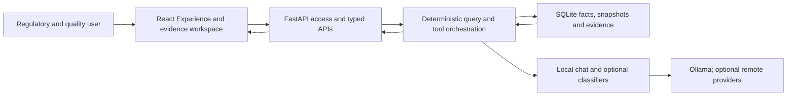
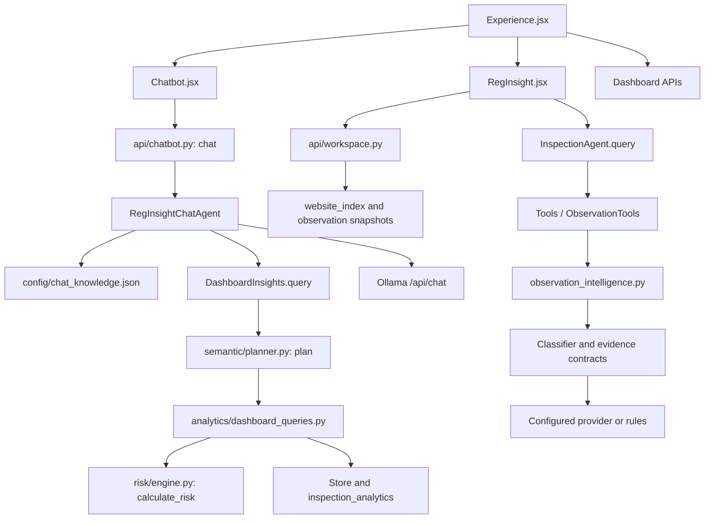
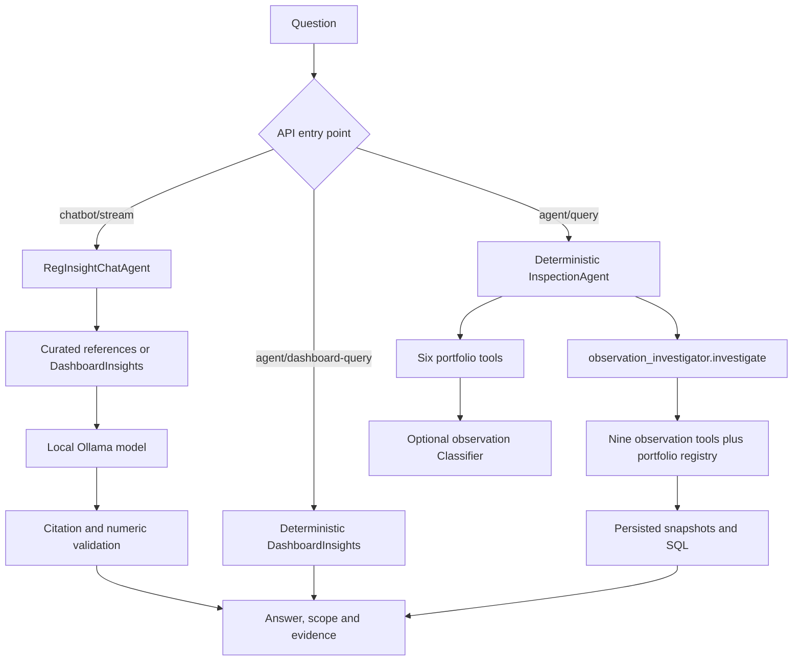
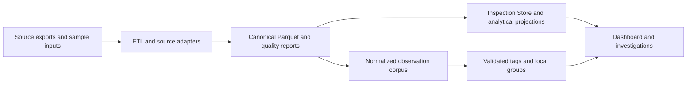

# RegInsight AI — implementation architecture

Audited against the final folder supplied on 2026-10-04. This is a React SPA served by FastAPI, with a prepared SQLite inspection database and a separate SQLite observation corpus. The browser starts in `frontend/src/main.jsx` → `Experience`. The earlier App shell is absent from the clean repository. Optional backend-only capabilities remain registered.

The eight blocks describe the running implementation. PostgreSQL can replace the inspection Store; observation, reference and QC storage still uses SQLite. Redis is optional. There is no separate autonomous supervisor, vector database service, trained RegInsight foundation model or generic natural-language SQL generator.

## Engineering detail

`create_app.lifespan` initializes Store → attaches the valid retrieval projection → Intelligence → RegInsightChatAgent. Routes are registered explicitly. Static assets are served under `/assets`; `/` serves `frontend/dist/index.html`. The UI uses local React state and hash anchors, not a separate path router. Deep links other than `/` are not general SPA routes.

## AI and orchestration

The registries contain 15 unique tools, not 15 autonomous agents. The classification service has seven provider labels: rules, mock, openai, claude, local, ollama and gemini; rules/mock are deterministic. The earlier observation workspace has its own rules/Claude batch path and remains accessible by API.

## Data flow

Stage owners: `pipeline.py`/`fda_source_adapter.py` → `database/load.py` → `services/mart.py`/`database/retrieval_mart.py`; separately `intelligence_sources.py` → `observation_intelligence.py` → `website_index.py` → `api/workspace.py`.

## Actual retrieval / RAG

| Path | Ingestion and chunking | Retrieval | Generation / output |
|---|---|---|---|
| Chat reference RAG | Curated entries in chat_knowledge.json; no automatic document ingestion | `tokens()` overlap, stable ranking, up to 3 entries scoring at least 1 | Ollama JSON answer; exact known citation IDs and numeric-token checks |
| Chat calculated facts | Existing inspection data; no embedding | `DashboardInsights.query` resolves filters, executes SQL and creates D1 evidence | Local model must choose an allowed deterministic statement verbatim |
| Observation similarity | Source citation/observation rows; SHA-256 normalized-text deduplication | Offline cosine grouping; query returns same-group records | Related evidence records; no retrieval-to-LLM answer path here |
| Supplied document search | `build_knowledge.py`: one PDF page or PPTX slide per FTS unit | FTS5 OR terms, SQLite rank, default top 10 | Quoted search matches with locator through QC API; not wired to the chatbot |

Default observation vectors are normalized lexical counts with domain aliases and a record-timing signal. Optional local sentence-transformer weights use normalized dense vectors, CPU inference and 12×12 random-hyperplane LSH tables. Group assignment considers at most 300 representatives, within a theme; default cosine threshold 0.78. It is approximate grouping, not globally exact nearest-neighbor ranking. Vectors are stored as SQLite JSON. No remote embedding calls, dedicated vector DB, reranker or semantic-query cache is implemented. Similarity defaults to 20 same-group records, ordered by ID, rather than a newly computed query-distance ranking.

Classification cache keys include normalized text, provider/model, taxonomy and prompt versions. SQLite provides durable tag/vector caches; optional Redis serves selected classification/snapshot get/put paths. `RedisCache.remember` itself is an in-process L1 cache with single-flight computation, not a Redis round trip. The browser uses exact request keys and short TTLs. These caches are not semantic answer caches.

## Security, execution and scale boundaries

Credentials stay server-side. Local scripts read process environment; `.env.example` is not automatically loaded. Shared-key access has HTTP-only sessions and same-origin write checks, but no SSO, per-user roles or authenticated electronic signatures. In-memory sessions, rate budgets and locks are per worker. Background jobs are in-process. Restart recovery, multi-worker coordination, audit governance, domain calibration and PostgreSQL/container deployment still require production work. See TEST_REPORT.md for observed results rather than historical claims.
