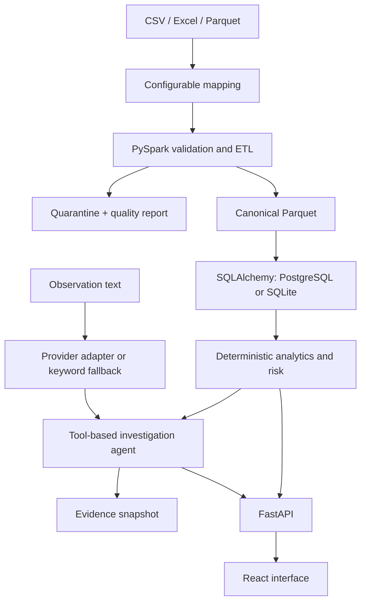
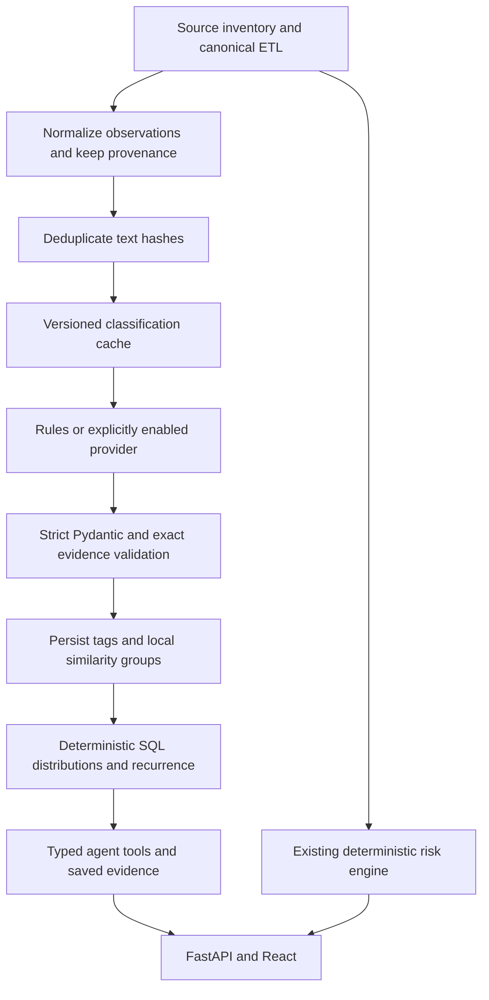

> Historical document from the final reference. Statements and old validation results below are not current certification. Use README.md and docs/TEST_REPORT.md for this delivery.

# Architecture and trust boundaries

The source contract is one row per inspection. Optional columns are nullable. Source row numbers and raw records survive ingestion. Multiple observation rows per inspection must be aggregated upstream; duplicate IDs are quarantined, not added to inspection counts.

## Numeric authority

LLMs receive observation text only. Numeric scores and responses are formatted from typed tool results. A provider may interpret text or synthesize qualitative drivers but cannot supply statistics to the rendered answer. Free-text generated content is labeled interpretation. The risk engine uses a versioned, deterministic keyword taxonomy independent of provider outputs so changing models cannot change scores.

## Risk method, version 1.0

All factors are in [0,1], weighted by `config/risk_weights.yaml`, and normalized to 100. Missing factors are excluded from the available-weight denominator. Coverage is always shown; a sparse score must not be interpreted as evidence of safety. No score is emitted with no measured factors.

* Citation history: positive flags / known citation flags.
* Classification history: (OAI + 0.4 × VAI) / known classifications.
* Recurring deficiencies: maximum repeated theme count minus one, divided by recurrence target (3), capped at 1. Count distinct inspections per keyword theme. Blank observation text is unavailable, not evidence of absence.
* Recency: latest adverse dated inspection, linearly decayed across 730 days. No adverse record yields zero only where adverse status and dates are known.
* Severity proxy: mean known observation count / configured cap (5), capped at 1. This measures burden, not validated clinical severity.
* Negative trend: positive change in citation rate between the latest two years with known citation flags. Fewer than two usable years yields unavailable.

Reference date is the ETL `as_of` date, stored with evidence, rather than the wall clock at each request. Reordering records cannot alter a score. Risk bands use unrounded scores: LOW <30, MODERATE <60, HIGH <80, CRITICAL >=80. No example risk values are embedded in the UI.

Yearly trend scores use only records through each year end and the earlier of that year end and the dataset reference date. Trend table inspection counts and rates refer to the individual year. Current-year comparisons are explicitly partial periods.

## Scale and deployment

Spark performs transformations, joins, windows and aggregates. This prototype uses a pandas reader for configurable Excel/CSV/Parquet ingest and bounded Arrow output on Windows; it is not a distributed ingestion benchmark. For substantially larger inputs, replace the reader with native Spark CSV/Parquet readers and preconvert Excel. Linux writes Parquet with Spark natively. Application analytics operate on filtered records; caching and SQL materialized aggregates are the next step for interactive analysis of 341,000+ records.

FastAPI and the JVM require a Python/JVM host; a Cloudflare Worker-only Sites deployment cannot run this stack. Docker Compose provides the reproducible full-stack deployment path with PostgreSQL and Java 17. Local development uses SQLite and serves the React production build from FastAPI.

This is a graduation prototype. Scores are prioritization heuristics, not FDA determinations. Authentication, multi-user authorization, migration management and production operations are future work; bind the local demo to loopback.

## Observation intelligence extension

The existing ETL, store and deterministic risk path are preserved. A separate immutable SQLite corpus in `data/intelligence` normalizes individual citation evidence and annual templates from canonical Arrow outputs and additional compatible raw inputs. It stores text hashes, observation occurrences, source origins, conflicts, classification cache, run membership and similarity assignments.

Remote output is never the numerical authority. `ai_severity_index` is separately named and excludes rules/fallbacks. Original risk taxonomy/configuration and formula remain unchanged. Full details and operational limits: [observation intelligence](observation-intelligence.md).

## Redis acceleration

The observation service now uses optional Redis cache-aside retrieval for completed run snapshots. Typed records and exact evidence are revalidated on cache hits. Durable databases remain authoritative; Redis is disposable. Classification tags can be reused from Redis and are persisted into SQLite before assignment. All query filters, page offsets and run IDs participate in keys. See [Redis configuration](redis-cache.md).
