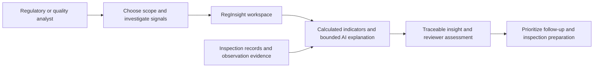

# Life Sciences guide

## Problem, people and evidence

RegInsight supports inspection intelligence and quality investigation: reviewing regulatory inspection history, finding repeated observation themes, comparing measured activity and prioritizing records for human review. Likely users are regulatory intelligence analysts, quality/compliance teams, inspection-readiness reviewers and managers allocating investigation effort. These personas are inferred from the implemented workflows, not verified organizational roles.

Inputs include prepared inspection/citation exports, separate annual observation-frequency tables, clearly labeled synthetic demonstrations and optional operational clinical QC records. The supplied inspection snapshot contains 274,886 inspections. The observation corpus has its own record grain and run identity; an observation row is not interchangeable with an inspection or a Forms 483 count.

| Life Sciences need | Implemented capability | Technical component | AI contribution | Potential business outcome |
|---|---|---|---|---|
| Inspect portfolio history | Filtered activity and NAI/VAI/OAI distribution | dashboard_queries, Store, Experience | Optional plain-language chat explanation | Faster orientation to measured inspection history |
| Prioritize site investigation | Explainable weighted score, missing-factor coverage | risk/engine, mart, DashboardInsights | None in score calculation | Review resources directed to transparent indicators |
| Identify repeated themes | Distinct-inspection recurrence and related observation groups | metrics, intelligence_taxonomy, Grouper | Optional observation classification; grouping is local computation | Easier evidence comparison across records |
| Understand a finding | Source-linked tags and original excerpts | observation_intelligence, contracts, Evidence.jsx | Optional provider interpretation under evidence checks | Quicker preparation for expert assessment |
| Ask about a chart | Scoped answers with explicit denominators | semantic planner, DashboardInsights | Deterministic analytics; local chat can explain bounded source facts | Less manual reconciliation between a chart and its evidence |
| Preserve expert judgment | Append-only Approve/Modify/Reject history | workspace.review, website_reviews | No autonomous approval | Traceable local review decisions |
| Compare annual patterns | Separate industry citation-frequency benchmarks | api/benchmarks | None | Context without mixing annual totals with site risk |
| Monitor operational clinical QC | Imported numerator/denominator rates, threshold signals and exploratory forecasts | qc_data, qc_signals | None; deterministic statistical calculations | Identify operational metrics requiring review |
| Search supplied references | Page/slide-addressable document search | build_knowledge, knowledge.search | None on this endpoint | Locate supplied reference evidence faster |

## Interpretation and decision boundaries

Counts, rates, trends and scores come from software calculations. The score is a prioritization heuristic, not a regulatory determination. “Severity” in observation intelligence is an analytical tag; the numerical risk factor called severity uses observation burden, not model-derived clinical severity. Missing citation indicators remain unavailable; posted citation-row counts are not substituted as a citation-rate denominator.

The local chatbot retrieves project definitions or database calculations before generating an explanation. Known source IDs and numeric tokens are checked; this does not prove every natural-language assertion. Model failure leaves retrieved evidence visible. Similar text does not establish regulatory equivalence or a shared root cause.

The reviewer can investigate records, document a local judgment and prioritize further assessment. The application does not implement a full CAPA execution system, controlled SOP lifecycle, pharmacovigilance case processing, clinical-trial management, submission publishing or regulatory certification. CAPA may appear as a text theme; that is not CAPA workflow management. Clinical QC is a retained API capability, not a visible current navigation screen.

Business value is the potential reduction in evidence-search and reconciliation effort. No measured time savings, validated decision accuracy or regulatory compliance certification is claimed. Human review, source-provenance confirmation and organization-specific validation remain necessary before operational reliance.
