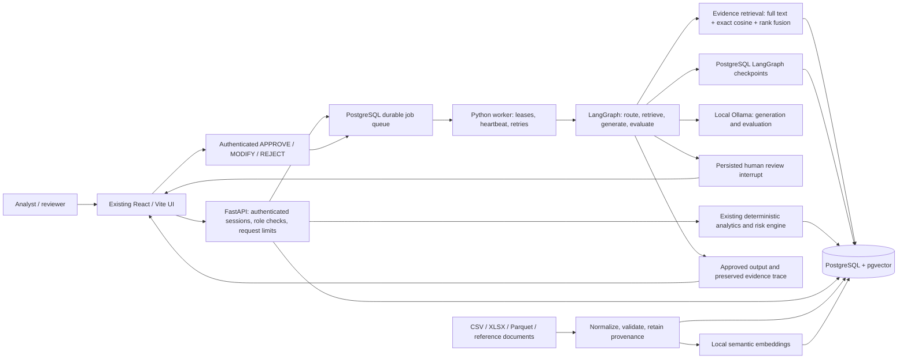
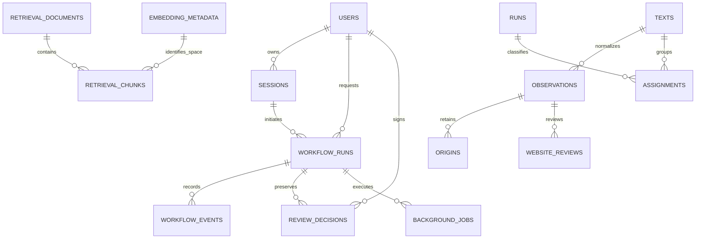

# RegInsight AI upgraded architecture

Implementation status and acceptance gaps are tracked in `PRODUCTION_UPGRADE_STATUS.md`. This describes the current code, not a claim of production certification.

The UI calls the same domain services for portfolio metrics, inspection evidence and existing review screens. Numerical results remain deterministic. The LLM does not calculate authoritative risk scores or execute arbitrary SQL.

Long-running workflow creation commits a workflow and queue record together. Workers claim rows with `FOR UPDATE SKIP LOCKED`. Each claim has a lease token; stale workers cannot heartbeat or finish a reclaimed job. PostgreSQL advisory locks serialize execution of the same workflow across processes. Maximum attempts default to three. Inference may be repeated after a crash before its result commits: this is not an exactly-once model execution guarantee.

LangGraph runs explicit routing, retrieval, generation and evaluation nodes. Insufficient evidence completes with an abstention. Required review interrupts persist in PostgreSQL. A reviewer decision records the account, rationale, original artifact, optional replacement, artifact version and workflow revision. Optimistic concurrency prevents a second decision on the same version. Approval resumes without a further model rewrite. Rejection regenerates only within the iteration bound.

PostgreSQL schemas retain the existing domain boundaries: `public` for inspection data, accounts, workflows and retrieval; `intelligence` for observation classification and provenance; `observation_workspace` for the existing review demonstration; `quality_control` for QC records/reviews; `knowledge` for source-addressable references; `staging` for imports. File exports are derived outputs, not alternative authoritative databases. Redis is optional cache only.

## Data relationships

Retrieval stores model identity, model digest, dimensions, chunk text, document metadata, content hash and source locators. Separate embedding spaces prevent comparing vectors from different model versions. The current implementation uses exact cosine search. ANN indexing and large-corpus capacity claims require separate scale testing; eight reference chunks cannot justify either.

## Boundaries and guardrails

- Authenticated individual accounts and server-derived reviewer identity.
- CSRF origin checks, allowed hosts, bounded body size and process-local rate limits.
- Typed requests, allowlisted tools, bounded iteration and provider budgets.
- Evidence/citation and numeric checks, domain restrictions and mandatory high-risk review.
- No arbitrary SQL execution or MCP layer.
- Request IDs, redacted logs, workflow events and stored retrieval traces support investigation.

These checks reduce specific failure modes. They do not prove narrative correctness. The same local model currently generates and judges by default, so its evaluation is not independent; consequential outputs still require an accountable human decision.
