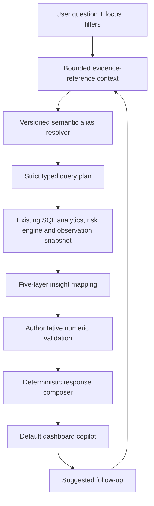

# Dashboard conversational analytics

## Contracts and semantics

`backend/semantic/catalog.py` is the canonical catalog. It defines 18 metrics, 15 dimensions, nine dashboard focuses, source fields, filter operators and null behavior. `/api/semantic/catalog` exposes that versioned catalog. `models.py` rejects unknown fields, metrics, dimensions, unsupported focus/filter combinations and invalid periods. SQL is never generated from unrestricted user text. A finite alias/rule planner chooses fixed analytical operations.

Inspection count, citation-positive count, posted citation count, NAI/VAI/OAI counts, rates and site counts are sourced from the canonical inspection database. Citation rate divides known positive indicators by known indicators; OAI rate divides OAI by NAI+VAI+OAI. Null denominators remain unavailable. Observation counts, severity, recurring themes and review requirements use the existing indexed inspection-grain observation snapshot. A theme recurs when it appears in more than one distinct inspection; recurrence count sums distinct inspections beyond the first per theme. Annual templates are excluded. Similarity is a candidate retrieval signal, not proof of regulatory equivalence.

The existing `calculate_risk` function and risk configuration are unchanged. Available-factor coverage accompanies site results. Analytical observation severity never enters this risk formula. Review-required means no latest Approve or Modify event in the existing append-only website review table.

Focus IDs: overall_dashboard, inspection_activity, classification_distribution, citation_oai_trend, risk_distribution, sites_to_investigate, recurring_risk_signals, observation_intelligence and data_quality. Supported dimensional combinations are validated, not silently dropped. Inspection years are calendar years; observation snapshot years are the supplied fiscal-year metadata.

## Context and trust boundary

The client sends question, focus, filters, up to 12 short history turns and an analysis ID. Each question/history item is at most 4,000 characters; environment settings can lower these limits. It never sends a chart object or raw dataset. The service resolves follow-ups from persisted, bounded site/theme/group references, tied to dataset identity and the originating dashboard filters. Filter changes invalidate those references. A fresh graph action resets client references. Server-side evidence retention remains a deployment responsibility; conversational history is bounded, but saved analyses are durable until managed by the deployment owner.

The five layers are scope, authoritative metrics, deterministic patterns, analytical context, and evidence/limitations. Numeric validation rejects substitutions in structured facts and insights. Narratives are deterministic templates; no model can supply numbers in this path. The broader provider-capable investigation agent remains separate. Unknown questions return a constrained-help error rather than invented answers.

Periods compare the latest two available years in the requested scope. Partial years are marked and are not presented as matched year-to-date comparisons. Differences are descriptive, with no causal claims. Source references, metric definitions, denominator availability, methodology version, dataset/run IDs and coverage are visible in expandable disclosures.

## Performance and compatibility

The code review identified the original dashboard's full-record scans, in-memory site ranking, repeated risk calculation, and the generic one-turn assistant in the default UI. The upgrade uses the existing materialized portfolio when available; filtered count/rate queries aggregate in SQL, and ranking is SQL ORDER BY/LIMIT/OFFSET. Missing scope-specific site summaries are derived by streaming one site's history at a time through the existing risk engine, then retained in a bounded 32-scope mart keyed by dataset, risk configuration and filters. Existing record-based metrics and SQL metrics are covered by parity tests.

Detailed evidence is bounded to ten rows per response; ranking/supporting results are at most 50. Further records can be requested with offset. The persisted evidence endpoint provides access to the saved sample, while detail requests query the selected scope. Source inspection IDs and file/row references remain authoritative.

The existing observation browsing index is reused. Detail tag lookups are capped at ten per response. Query-stage timings are structured internal logs, not UI debug output. Database errors surface without credentials. The original investigation route and review APIs are retained.

Validated here against 274,886 real inspection records and 280,114 observations. Multi-million-row throughput was not benchmarked. For larger or concurrent deployments, precompute common filter marts as background jobs, use PostgreSQL, index frequent dimensions and tune materialization/retention. First-time uncommon scopes can be slower because risk scoring needs each site's history. Shared-key sessions and rate limits need an external shared store before multi-worker deployment.

## Security boundaries

`backend/api/security.py` adds loopback-only operation without a key, optional shared-key login, bounded in-memory sessions, constant-time key comparison, logout revocation, eight-hour expiration, host validation, same-origin write enforcement, streamed 4 MB body bounds, per-client rate limiting and restrictive security headers. Production mode requires a strong key and HTTPS cookies. No credentials are included in the package. SSO, individual authorization, tamper-evident review identities, formal validation and external penetration testing remain unimplemented integration work.
