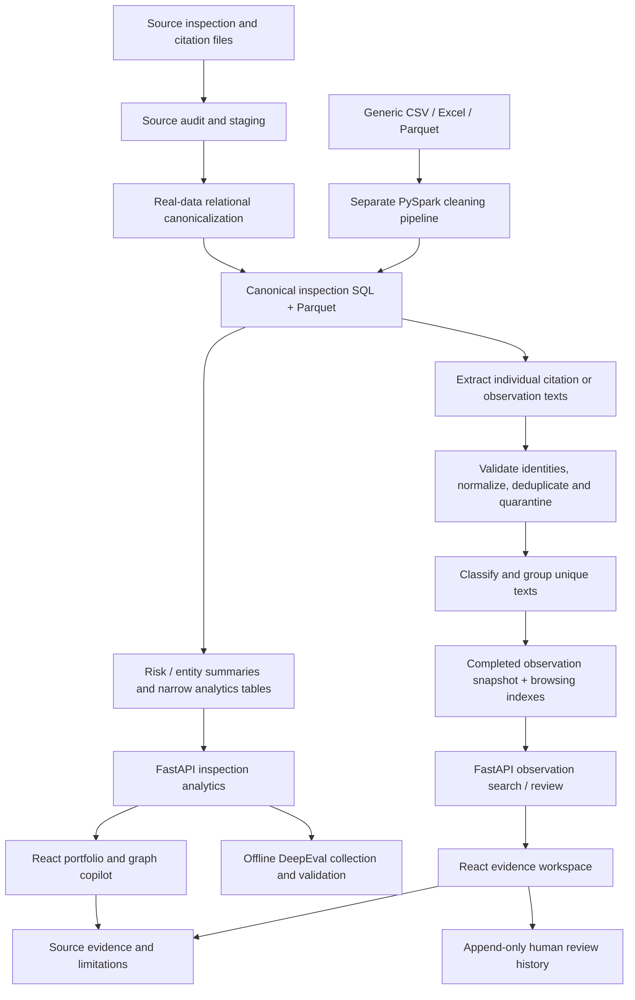
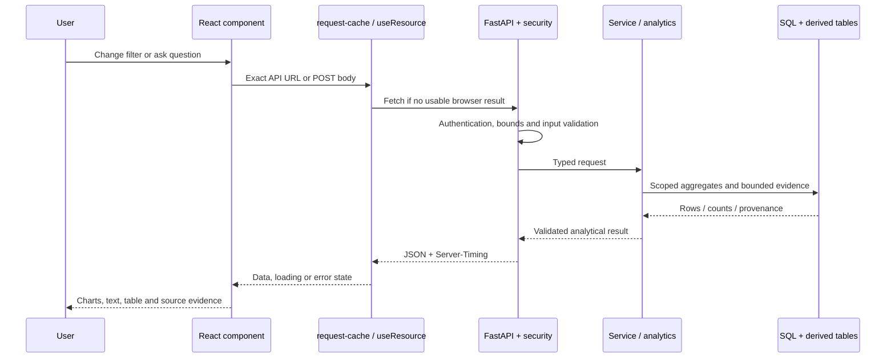

> Historical source walkthrough, retained for provenance. The inactive App.jsx subtree described below was removed in the 2026-10-04 cleanup. See FILE_MAP.md and TECHNICAL_WALKTHROUGH.md for the current implementation.

# RegInsight AI: code, concepts, pages and data flow

Source walkthrough prepared 28 September 2026. Read this guide in order, then use the companion source atlas to inspect the actual numbered lines. Links point to the current local source, not a generic architecture. The atlas covers application, data-engineering, evaluation, configuration, frontend and test source; it excludes datasets, dependencies, secrets and generated build files. Its per-line notes describe code structure; the explanations below describe business meaning. Some JSX/CSS files put an entire component on one physical line, so one numbered line can implement several controls.

## 1. What this application actually is

RegInsight is a regulatory-inspection analytics and evidence-review application. It has two distinct analytical populations: canonical inspections and observation/citation text records. An inspection can have multiple observation records. Their totals are not interchangeable. This is inspection intelligence, not a manufacturing execution system that records production batches or machine telemetry.

The delivered dataset is described as 274,886 canonical inspections, 133,375 sites, and a separate 280,114-observation snapshot. These are the supplied application's populations, not an invented one-million-row dataset. Authoritative dataset metadata lives in the database `dataset.payload` and completed observation `runs.payload`; do not hard-code these numbers into future calculations.

The live entry point is [[frontend/src/main.jsx]]. It mounts `Experience`, plus the developer-credit footer. `frontend/src/App.jsx` (removed legacy file) is the older application shell and is **not mounted** by that entry point. Its additional pages still exist in source, and many associated APIs remain registered, but they are not all visible in the current navigation.

The standard launcher [[Start-RegInsight.ps1]] defaults to port 8018. The preview used in this conversation was started separately on 8021. A running process must be restarted to pick up Python edits; Vite's production frontend must be rebuilt to pick up JSX/CSS edits. A browser refresh alone does not reload Python modules.

## 2. The complete conceptual flow

There are three timings to distinguish: **offline ingestion** prepares data; **startup preparation** restores/builds missing derived structures; **interactive requests** fetch filtered, bounded results. Data cleaning does not rerun for every website click.

## 3. Reading and cleaning the data

### 3.1 The supplied real-data route

[[data_engineering/source_review.py]] audits source workbooks and builds staging tables. Its job precedes the canonical adapter: inspect source schemas and identities, preserve workbook/row provenance, and identify the separate annual-benchmark population. [[data_engineering/dataset_inventory.py]] inventories candidate files; inventory is discovery, not automatic proof that every discovered file is loaded.

[[data_engineering/fda_source_adapter.py#canonicalize]] receives all project rows for one inspection plus its citation rows. Read its statements in this order:

1. `first = group[0]` chooses the source metadata anchor for the group.
2. The FEI/date set must contain one identity. A conflicting group raises an error rather than merging incompatible inspections.
3. The date is parsed and checked against `as_of`; a future date is rejected.
4. The `CLASS` dictionary converts the three known source labels to NAI, VAI and OAI; unknown source classifications are rejected in this adapter.
5. Projects and products become sorted distinct collections. Multiple project rows do not become multiple inspections.
6. `max(classes, key=RANK.get)` chooses the worst recorded project classification, OAI > VAI > NAI. Original project classifications remain in the payload.
7. Every citation must match the inspection ID, FEI and date.
8. `raw` retains source file names, row numbers and original records. The concatenated observation text is derived from citation descriptions.
9. Whitespace is normalized in company names; the case-folded `company_key` supports consistent lookup. FEI becomes `site_key`.
10. The returned canonical dictionary contains fields for analytics and separate evidence/provenance fields.

Important data meaning: `citation_indicator`, `citation_flag`, and `observation_count` are explicitly **None** when not supplied. `posted_citation_indicator` describes publication and `available_citation_count` counts the citation rows available in the export. They are not substituted for the missing citation-rate denominator or total observation burden.

[[data_engineering/fda_source_adapter.py#import_reviewed]] performs an ordered merge of staged inspections and citations, inserts batches of 1,000 canonical inspections into SQL, writes `canonical_inspections.parquet`, and writes `quality.json`. It retains annual benchmarks separately. It sets the dataset identity and records source hashes/metadata from the audit report. This route is Python/SQL/PyArrow; it is not the generic Spark job.

### 3.2 The separate generic PySpark route

[[data_engineering/pipeline.py#read_source]] supports CSV, Excel and Parquet. CSV values are initially strings to avoid losing identifier formatting through premature type inference. Excel/Parquet missing cells are normalized for the conversion path. Unsupported formats fail clearly.

[[data_engineering/pipeline.py#transform]] then:

| Operation | How the code implements it | Why it matters |
|---|---|---|
| Schema mapping | Checks canonical field names and mapping uniqueness | Prevents ambiguous columns |
| Source provenance | Adds `source_row` and serialized `source_record` | Every output can be traced back |
| Missing values | Trims text; blank strings become null | Missing is distinct from zero |
| Company identity | Collapses whitespace; adds lowercase company key | Consistent grouping |
| Classification | Removes punctuation, uppercases and maps known labels | NAI/VAI/OAI become comparable |
| Dates | Tries three explicit date formats | Invalid dates can be quarantined |
| Observation counts | Uses safe casts; rejects negatives/fractional values | Invalid counts cannot enter averages |
| Citation indicator | Maps explicit yes/no-style values to 1/0 | Unrecognized values stay unknown |
| Missing IDs | Builds a SHA-256 ID from canonical source values | Stable identity, not fabricated facts |
| Duplicate IDs | Window partitions by ID, orders by source row | Later repeated IDs go to duplicate output |
| Rejections | Concatenates invalid-date/count/identity reasons | Human-readable quarantine reasons |
| Derived fields | Adds year, month, recency, site key and ranks | Analytics need stable dimensions |
| Quality | Counts valid/rejected/duplicate/missing values | Reports what was actually retained |

This route differs from the real adapter: generic repeated IDs are quarantined, while the real adapter intentionally merges known project rows belonging to one inspection. Also, generic unknown classifications become null, while the audited adapter rejects unexpected labels. Do not describe these as one identical cleaning policy.

[[data_engineering/pipeline.py#export_frame]] writes Spark-produced output using Arrow batches on Windows and native Spark Parquet output elsewhere. [[data_engineering/pipeline.py#run]] produces valid, rejected and duplicate Parquet outputs plus a quality report. The source read initially uses pandas, so this is not a claim that every ingestion step is streaming or suitable for unlimited input sizes.

[[backend/database/load.py#load]] loads the generic processed Parquet files, restores date/integer types, checks the valid-record count against the quality report, and calls `Store.replace`.

## 4. Database storage and startup

[[backend/database/store.py]] defines the inspection database using SQLAlchemy. Indexed scalar columns make filtering possible without decoding every full evidence payload. The JSON payload preserves the detailed record.

| Structure | Purpose | Main writer / reader |
|---|---|---|
| `inspections` | Canonical inspection rows plus complete evidence payload | Adapter/load → Store/API |
| `dataset` | Dataset version, quality, as-of date and cached portfolio metadata | Load/mart → services |
| `evidence` | Saved analysis facts, references, plan and limitations | Assistant → evidence/follow-up endpoints |
| `entity_summaries` | Precomputed company/site risk summaries | `mart.build` → rankings |
| `inspection_analytics` | Narrow inspection projection without full source JSON | Retrieval preparation → filtered aggregates |
| `retrieval_versions` | Dataset/version marker for the projection | Retrieval preparation/attach |
| `dashboard_scope_sites` | Risk summaries for an exact filtered scope | `site_scope` → ranking/distribution |
| `dashboard_scope_runs` | Which filtered scopes have been built | Scope retention and reuse |

[[backend/database/store.py#replace]] rejects repeated inspection IDs, calculates a dataset hash and transactionally replaces inspection/dataset records. [[backend/database/store.py#search]] applies typed filter branches, supports count-only and lightweight projections, and bounds detailed output when a limit is supplied.

[[scripts/prepare_workspace.py#prepare]] restores the supplied canonical Parquet and tagged observation snapshot when the necessary stored data is missing; it builds entity summaries when needed. Restoring the snapshot does not call an LLM to reclassify every observation.

[[scripts/prepare_retrieval.py#run]] prepares the narrow projection, indexes and observation summaries. [[backend/database/retrieval_mart.py#table_for]] uses the projection only when its attached dataset ID matches the current dataset. A replacement falls back to canonical data until the projection is rebuilt.

[[backend/api/main.py#create_app]] owns startup/lifespan: create or accept a Store, attach the prepared projection, construct `Intelligence`, register security and API routers, mount the built frontend assets, and serve `frontend/dist/index.html` at `/`. The browser does not read SQLite directly.

## 5. Observation cleaning, classification and related-record retrieval

[[data_engineering/intelligence_sources.py#from_inspections]] extracts individual citation texts when citation provenance exists. Otherwise it uses the inspection's observation text. One inspection may yield several observation rows; annual templates use their own grain.

[[data_engineering/intelligence_sources.py#add]] checks for a nonempty normalized text, source identity and valid IDs. Invalid rows go to `quarantine`. It records conflicting inspection metadata instead of silently combining it. Text hashes deduplicate the normalized text; observation IDs still distinguish records and origins. `INSERT OR IGNORE` preserves duplicate accounting, and `origins` keeps source references.

The observation database schema is defined by [[data_engineering/intelligence_sources.py#db]]:

| Table | Meaning |
|---|---|
| `texts` | One normalized text per hash |
| `observations` | Record identity, inspection relationship, dataset/grain and source payload |
| `identities`, `conflicts`, `quarantine` | Identity validation and rejected/conflicting data |
| `origins` | Original source locations for observation records |
| `cache` | Validated classification payloads |
| `runs` | Snapshot status, provider/model and processing metadata |
| `members` | Which observations belong to a run |
| `assignments` | Text-to-classification/group mappings for that run |
| `embeddings` | Cached local vectors keyed by text, model and version |
| `website_index` | Narrow browser filter/sort index for completed runs |
| `website_reviews` | Append-only review decisions, separate from original tags |
| `retrieval_summaries` | Precomputed summaries keyed by run and dataset |

[[backend/services/observation_intelligence.py#_run]] creates a run, records its membership, processes unique texts in bounded batches, groups them, reuses validated classifications when possible, and records assignments. Only after processing does it mark the run completed. `latest` resolves a completed snapshot for subsequent reads.

[[backend/genai/classifier.py#Classifier]] supports rules and configured provider adapters. [[backend/genai/contracts.py]] validates the classification structure and evidence against the actual observation text. Invalid/unavailable remote output can fall back to explicit deterministic rules with fallback provenance. An LLM response is not automatically trusted because it is valid JSON.

The supplied launcher explicitly sets `AI_PROVIDER=rules` and `AI_ENABLE_REMOTE=false`. Core portfolio answers are deterministic templates. Provider adapter code exists, but that does **not** mean the running local app is making OpenAI, Claude or Gemini calls.

[[backend/analytics/observation_groups.py#Grouper]] defaults to local normalized lexical vectors and cosine similarity. It can use a preinstalled sentence-transformer model when configured; that is a separate optional path. Candidates are bounded, groups are compared within the theme-based index, and the default similarity threshold is 0.78. This is not a claim of vector-database retrieval or regulatory equivalence.

[[backend/services/observation_intelligence.py#tags]] reconstructs bounded, validated observation records with source quotes. `similar` finds other records assigned to the same group and returns their evidence. `metrics` aggregates observations/themes but counts distinct inspections separately. Never multiply an annual frequency into invented inspection records.

## 6. Metrics, risk and graph text

[[backend/analytics/metrics.py#metrics]] is the basic metric implementation. [[backend/analytics/dashboard_queries.py#aggregate]] is the SQL aggregation path used for dashboard scopes. The test suite includes parity comparisons so that the SQL and record-based calculations agree on supported scopes.

| Measure | Calculation / population |
|---|---|
| Total inspections | Number of canonical inspections matching the filter |
| Citation rate | Positive citation indicators / known citation indicators; null if no known denominator |
| OAI rate | OAI inspections / inspections with known NAI/VAI/OAI classification |
| Average observations | Sum of known counts / number of known counts |
| Inspection frequency | Dated inspections / distinct observed calendar years |
| Recent inspections | Dated inspections within 365 days of the dataset's as-of date |
| Attention sites | HIGH + CRITICAL site counts; not an inspection count |
| Recurrence | Distinct inspection IDs containing a theme; repeat count is count minus one |

[[config/risk_weights.yaml]] supplies weights: citation history 25, classification history 25, recurring deficiencies 20, recency 10, severity 10, negative trend 10. `calculate_risk` in [[backend/risk/engine.py#calculate_risk]] computes the six factors:

- Citation history: the known-denominator citation rate.
- Classification history: `(OAI + 0.4 × VAI) / known classifications`.
- Recurring deficiencies: the maximum theme repeat count divided by 3, capped at 1, when text exists.
- Recency: adverse-event recency within a 730-day scale, clamped at zero; unavailable when the prerequisite dated/classification information is missing.
- Severity: average observation count divided by 5, capped at 1. This is a burden proxy, not the observation-text severity classifier.
- Negative trend: positive change between the last two available annual citation rates.

Let A be the sum of weights for available factors. `score = 100 × Σ(weight × factor) / A`. Missing factors are omitted from A, not treated as zero. Coverage is `100 × A / total configured weight`. No available factors means insufficient data. Bands use the unrounded score: LOW below 30, MODERATE from 30, HIGH from 60, CRITICAL from 80.

Example for explaining the formula only: if only classification and recency are available, with factors 0.4 and 0.5, the score is `100 × (25×0.4 + 10×0.5) / 35 = 42.86`, with 35% coverage. This illustrative calculation is not a claim about a real site.

[[backend/services/mart.py#build]] precomputes company/site summaries using that same risk engine. It also stores portfolio metrics and trends. It holds narrow records/groupings in memory during the build; it is not an unlimited-memory ingestion design.

[[backend/analytics/dashboard_queries.py#site_scope]] keys filtered risk summaries by dataset, methodology and filters. [[backend/analytics/graph_insights.py]] produces the graph headline and explanation from computed values, including missing-denominator and partial-year caveats. [[frontend/src/experience/Experience.jsx#ChartCard]] renders this text beside charts. The chart explanation is not an independently generated numerical answer.

## 7. How a request travels through the system

[[frontend/src/reginsight/data.js#useResource]] tracks the requested path and refresh version, manages an AbortController, and prevents an older request from replacing the currently requested scope. [[frontend/src/reginsight/request-cache.js#cachedRequest]] shares duplicate in-flight GETs, clones results and caches by exact URL. A caller abort does not abort another caller's shared request.

The browser cache is memory-only, up to 32 entries / 8 MB, with a 15-second TTL and a 2 MB per-result cap. Mutations clear its generation; a previous in-flight read cannot repopulate a later generation. Auth/status requests are excluded. These are deliberate JavaScript caches even though the HTTP API sends `Cache-Control: no-store`.

[[backend/cache/redis_cache.py#remember]] implements a process-local cache with an Event per in-flight key, copying results and avoiding cached failures. Limits are 128 entries / 32 MB, with the configured maximum individual value. Inspection dashboard/plan entries default to 300 seconds; website summary/page entries use 60 seconds. Redis `get`/`put` is an optional separate acceleration path for classification/snapshot calls; the launcher disables Redis. `remember` does not turn every query into a Redis query.

[[backend/cache/retrieval.py#inspection_identity]] includes database/engine, dataset, as-of and methodology identity. `workspace_cache` includes database path, run, review revision and arguments. [[backend/services/retrieval_search.py]] uses optional FTS5 trigram candidate lookup and then the original literal substring predicate. Short/unsupported query paths fall back to the literal scan. [[backend/services/website_index.py#ensure]] builds a narrow index only for completed runs.

These mechanisms reduce repeated work; they do not guarantee zero latency. A new filter can still need aggregation and risk computation. Short searches may scan. Cache state, disk, network and concurrent users affect timings.

## 8. Every screen in the current website

| Screen / area | Frontend implementation | Input → processing → output |
|---|---|---|
| Landing page | `Experience.jsx`: `Landing`, `Brand`; `EvidenceScene.jsx` | Static sections + auth status → React + Three.js → logo, animation and workspace button |
| Sign-in screen | `Experience.jsx`: `Login` | Access key → `/api/auth/login` → session cookie or inline error |
| Portfolio | `Experience.jsx`: `Portfolio` | Company/year/classification filters → `/api/dashboard` → KPIs, four chart areas, risk distribution, ranked sites |
| Graph insights | `ChartCard`, `graph_insights.py` | Same dashboard metrics/trend → deterministic summary → headline and explanatory text |
| Portfolio copilot | `Experience.jsx`: `Copilot` | Question, focus, filters and context → `/api/agent/dashboard-query` → structured answer and evidence |
| Evidence workspace / Overview | `RegInsight.jsx`, `Charts.jsx` | Dataset → `/workspace/summary` plus `/dashboard` → snapshot and portfolio measures kept separate |
| Evidence workspace / Observations | `RegInsight.jsx` | Search, run, dataset, severity, year, theme, sort, offset → `/workspace/observations` → eight-row table and total |
| Evidence workspace / Risk analysis | `RegInsight.jsx` | `/dashboard` site risk plus `/workspace/summary` text severity → side-by-side distributions with their distinct populations labeled |
| Source panel | `Evidence.jsx`: `Source` | Selected observation → original text, quote, source row/file and tag metadata |
| Reason panel | `RegInsight.jsx` | Selected tag/group metadata → rationale, matched quote, taxonomy/prompt versions and similarity to group representative |
| Related panel | `RegInsight.jsx` | Selected observation/run → `/observations/similar/{id}` → related group records |
| Human review panel | `Evidence.jsx`: `Review` | Record/run + decision + expected revision → `/workspace/reviews` → saved revision and history |
| Evidence-workspace assistant | `Assistant.jsx` | Question → `/agent/query`, then `/evidence/{analysis_id}` → investigation answer and source records |
| Methodology/risk/evidence sections | `RegInsight.jsx` | Explanatory sections and available records → methodology text, signals and evidence links |
| Documentation and informational dialogs | `RegInsight.jsx`: `Dialog`, `Documentation` | Click → native HTML dialog → local explanatory content; not separate server-rendered pages |
| Logo and credits | `Experience.jsx`: `Brand`; `main.jsx`; `branding.css` | Local Agilisium PNG + GitHub URL → primary logo and “Developed by 1nb-nt” |

The frontend uses React state and hash navigation, not a separate server URL/controller per visible section. The evidence workspace's informational Sign In dialog is distinct from `Experience`'s real access-key login. Inspect the current JSX rather than assuming a button label implements authentication.

[[frontend/src/experience/EvidenceScene.jsx]] lazy-loads the 3D scene, starts playback automatically, and exposes pause/play. Reduced-motion handling slows/simplifies the animation. The scene is conceptual decoration; it does not depict real inspection relationships. [[frontend/src/experience/experience.css]] controls layout/type, and [[frontend/src/experience/branding.css]] adds the supplied wordmark and credit styling.

For React concepts: `useState` holds local selections/results; `useEffect` runs fetch/lifecycle work; `useRef` retains a controller/DOM reference across renders; props carry data/callbacks into components; conditional JSX selects visible states; `.map()` renders repeated charts/rows. State updates trigger React rendering, not a fresh ingestion job.

## 9. Portfolio copilot: one complete execution trace

Start at [[frontend/src/experience/Experience.jsx#Copilot]], then [[backend/api/dashboard_assistant.py]], [[backend/semantic/models.py]], [[backend/semantic/planner.py#plan]], and [[backend/services/dashboard_insights.py#DashboardInsights]].

1. The user asks “Which sites have the highest risk?” with current dashboard filters.
2. The UI posts a `QueryRequest`: question, focus, filters, limit/offset and optional context analysis ID.
3. Pydantic rejects unknown filter fields, unsupported values, oversized questions, invalid limits and contradictory ranges.
4. `DashboardInsights.query` loads the previous saved analysis when supplied and ignores context from another dataset or analysis kind.
5. The planner uses supported aliases/intent rules and prior result references to build a `QueryPlan`. It does not accept arbitrary generated SQL.
6. `execute` uses the plan cache for inspection analytics; review-dependent observation queries take their separate path.
7. SQL produces scope totals, risk distribution and ranked site rows. Bounded evidence comes from canonical inspection payloads.
8. `query` builds layers: scope, metrics, patterns, context, evidence and limitations.
9. `compose` selects deterministic headlines, insight objects and suggested follow-up questions.
10. `validate_numeric` checks structured insight numbers against the authoritative metrics/patterns. It is an internal consistency check, not an independent source audit of every natural-language sentence.
11. A new evidence ID is generated and persisted with the question, plan, references and facts. Analytical caching does not reuse a whole conversation response/evidence ID.
12. React renders the headline, rows, figures, limitations and source evidence.

Follow-up “Why is the first one high?” uses the saved ranked result's first key. That key narrows the query to the selected site; the risk engine returns score, components and coverage. “Show the inspections” then retrieves evidence for that resolved scope. Changing the dashboard scope must invalidate the previous conversational selection.

[[backend/semantic/catalog.py]] defines supported metric concepts; [[backend/semantic/resolver.py]] resolves aliases; `planner.py` determines a supported intent and filters; `models.py` validates the request/plan/response contract. “Semantic layer” here means this explicit catalog/planner/contract boundary, not automatic understanding of every possible question.

The older evidence-workspace assistant uses [[backend/agents/investigator.py]] and [[backend/tools/registry.py]]. Observation-focused investigations also use [[backend/agents/observation_investigator.py]] and [[backend/tools/observation_tools.py]]. It is a separate route from the graph copilot, with its own tool trace/evidence format. Do not describe all assistant buttons as calling one identical agent.

## 10. Human review: another complete execution trace

[[frontend/src/reginsight/Evidence.jsx#Review]] fetches history for the selected observation/run. The user supplies Approve, Modify or Reject, a reviewer label and note; Modify also requires a supported theme/severity. It posts the last seen revision.

[[backend/api/workspace.py#review]] validates that the record exists in the snapshot and that a modification uses supported taxonomy values. `BEGIN IMMEDIATE` serializes the SQLite revision check/write. If another decision changed the revision, the API returns 409. Otherwise it inserts revision + 1 with timestamp and the original classification. The original tag is retained. History is returned newest first.

The browser invalidates GET results after a successful mutation and refreshes the relevant views. Server website cache identity includes the latest review row revision marker. Reviewer names remain self-reported, not verified individual identities or digital signatures.

## 11. Retained older pages and optional concepts

These are included to explain **every page implementation present in source**, but they are not all navigation destinations in the current `Experience` shell. To activate them would require a separate UI wiring change.

| Retained page | Source | Its concept / backend family |
|---|---|---|
| Older Dashboard | `frontend/src/pages/Dashboard.jsx` | Portfolio summary; `/dashboard` |
| Inspections/Profile/Risk/Trends/Recurrence | `frontend/src/pages/Explore.jsx` | Filtered records, company/site profile, risk components, trends, recurrence |
| Data Quality | `frontend/src/pages/Quality.jsx` | Import quality and rejected/duplicate records; `/data-quality` |
| AI Agent / Observation Analyzer | `frontend/src/pages/Agent.jsx` | Older investigation and text-analysis interfaces |
| Annual Benchmarks | `frontend/src/pages/Benchmarks.jsx` | Separate annual frequency population; benchmarks API |
| Observation Workspace | `frontend/src/pages/ObservationWorkspace.jsx` | Earlier observation/tagging interface |
| Observation Intelligence | `frontend/src/pages/ObservationIntelligence.jsx` | Run, theme, group and severity exploration |
| Clinical QC | `frontend/src/pages/QCWorkspace.jsx` | Optional QC datasets/connections and signals; QC APIs/services |
| Data & Knowledge | `frontend/src/pages/DataKnowledge.jsx` | Dataset/knowledge inventory and exploration |

[[backend/services/qc_data.py]], [[backend/services/qc_connections.py]] and [[backend/services/qc_signals.py]] implement the optional QC backend. [[backend/services/knowledge.py]] supports the knowledge feature. Their existence is not evidence that a remote database is connected or that synthetic/demo QC data is part of the current real inspection portfolio. The companion endpoint catalog lists exact registered routes and their source handlers without relying on page labels.

## 12. Security, errors and operational boundaries

[[backend/api/security.py#install_security]] validates allowed hosts, rejects cross-origin writes, restricts remote API access without a configured key, verifies signed/session-tracked cookies, limits API/login requests, bounds write bodies to 4 MB, and attaches security headers. Current rate limits are 180 API requests and 10 login requests per minute per tracked client bucket. Cookies are HTTP-only, SameSite Strict and expire after eight hours; production mode requires a sufficiently long key and adds Secure/HSTS behavior.

This is shared-key access for a trusted team, not individual roles/SSO or tenant isolation. Sessions/rate limits are process-local. Local default operation is not a claim of publicly deployed HTTPS. [[backend/genai/request_gate.py]] separately bounds remote AI requests; [[backend/genai/redaction.py]] handles configured secret redaction in logs.

[[backend/api/main.py#create_app]] maps validation/data-access errors to JSON responses. Frontend resource hooks turn failed responses into loading/error/retry states. `Server-Timing` measures server middleware duration; it is not full browser rendering or internet latency.

## 13. DeepEval and validation: what is actually checked

[[scripts/collect_evaluation.py#run]] calls the live graph-copilot endpoint for six scopes, each first/repeat: portfolio, year 2025, OAI, year+OAI, empty company and a second page. Expected counts, ordered inspection IDs and source fields are derived independently from canonical SQLite queries, not from the response being scored.

[[evaluation/metrics.py#ContractMetric]] implements real DeepEval custom metrics:

| Metric | Exact checked relationship |
|---|---|
| Numeric agreement | Expected core inspection/classification counts equal returned metric values |
| Retrieval precision | Expected returned IDs / all returned IDs, with explicit empty-result handling |
| Retrieval recall | Retrieved expected IDs / expected bounded page IDs, not recall across the entire corpus |
| Evidence grounding | Returned source fields/quote agree with independently collected source context |
| Scope correctness | Returned non-null filters and offset match the expected scope |
| Latency budget | Measured response time is finite, nonnegative and within the configured budget |

[[evaluation/run.py#run]] constructs `LLMTestCase` objects and runs `deepeval.evaluate` offline, with telemetry/dotenv disabled and network connections blocked. It also corrupts one aspect of an answer at a time to ensure all six gates reject their negative control. [[requirements-eval.txt]] pins the evaluation dependency separately from the web app.

Current collector budgets are 5,000 ms for the first request and 1,000 ms for a repeat. Earlier work used a stricter 3,000 ms first-request budget; one OAI request failed it and the budget was later relaxed. Consequently “12/12 passed” describes the later budget, not proof that all first requests take under three seconds. First/repeat samples do not flush operating-system caches and are not a production load or p95 test.

The checks are deterministic retrieval/contract tests, not an LLM judge's assessment of broad answer relevance or clinical correctness. The score does not validate every page, every query, or regulatory compliance. The source atlas includes all tests so their actual coverage is inspectable. Optional Spark tests require PySpark; the previous application test run reported two errors because it was absent, alongside passing application tests. No fresh full test suite was run merely to produce this document.

## 14. A practical flow for explaining this project aloud

1. **Purpose:** “We turn regulatory inspection exports into scoped analytics and traceable evidence for human review.”
2. **Population:** “An inspection and an observation are different record types; we keep their denominators separate.”
3. **Cleaning:** Open `canonicalize`; explain identity checks, project merging, source preservation and why unknown values remain missing.
4. **Storage:** Show `Store`, the observation schema and one payload shape. Explain indexed dimensions versus detailed JSON evidence.
5. **Preparation:** Show `mart.build` and `prepare_retrieval`. Explain why calculations/indexes are prepared before repeated browsing.
6. **Numerical logic:** Open `calculate_risk` and the YAML weights. Walk through the available-weight formula and coverage.
7. **One page:** Open the Portfolio component; change a filter. Trace `useResource → /dashboard → Intelligence → dashboard_queries → SQL → JSON → chart`.
8. **One question:** Ask for highest-risk sites. Trace `QueryRequest → planner → QueryPlan → execute → layers → numeric validation → saved evidence → Copilot`.
9. **One source record:** Open the evidence workspace. Show source quote, source file/row, related records and the distinct observation population.
10. **One review:** Explain revision checking and append-only history; the original tag remains inspectable.
11. **Performance:** Explain browser request sharing, bounded server caches, narrow projections and indexes. Distinguish first-load work from warm requests.
12. **Validation and limits:** Show DeepEval expected-source queries, metric gates and negative controls. State which optional modules/providers are inactive.

Suggested presentation timing: two minutes for purpose/data, three for cleaning/storage, three for analytics/retrieval, three for page and question demonstrations, and two for review/evaluation/limits. For a code interview, take one trace above and open each linked function in order instead of reading files alphabetically.

## 15. How to use the companion source atlas

Open `RegInsight-Code-Atlas.html`. Search by path, function name, endpoint or code text. Each file includes its SHA-256, local imports, an AST-derived Python symbol index (or declaration-based JavaScript index), and all original physical lines with structural reading notes. Click a symbol to jump to its line. Direct Python call expressions are listed as **static references**, not asserted to be executed on every request. Dynamic calls, React render relationships and runtime provider selection require the conceptual traces above.

The atlas is a source snapshot: editing the application later can move line numbers. Use the included manifest to tell which version was documented. A generated structural note is a reading aid, not a substitute for the business explanation or a formal code review.

## 16. Concepts you should be able to explain

| Concept | Meaning in this project | Where to point in the code |
|---|---|---|
| ETL | Read, normalize/validate, then persist data | `pipeline.py`, `fda_source_adapter.py` |
| Canonical schema | Consistent field names/types across source formats | `pipeline.CANONICAL`, `canonicalize` |
| Grain | What one row represents: inspection, observation or annual template | `intelligence_sources`, workspace cohort filters |
| Provenance | Source file/row/original record retained beside derived values | `source_record`, observation source/origins |
| Null versus zero | Unknown values must not claim no events occurred | `ratio`, canonical adapter, risk factor coverage |
| Hash/identity | Stable content-derived identifiers and change/version keys | `Store.replace`, text digests, classifier cache key |
| SQLAlchemy | Python query/table expressions compiled for the configured SQL database | `Store`, `dashboard_queries` |
| Transaction | Related database changes commit together or roll back on error | `engine.begin`, review revision transaction |
| SQL index | Extra lookup/order structure that reduces scan/sort work | `retrieval_mart.prepare`, website indexes |
| Materialized summary | Persisted result computed before interactive use | `entity_summaries`, `retrieval_summaries` |
| JSON versus Parquet | JSON carries nested records/API payloads; Parquet stores columnar datasets | Adapter, load, API responses |
| Pydantic contract | Enforced shape/ranges/allowed values for input and output | `semantic/models.py`, `genai/contracts.py` |
| REST/API | Browser calls a typed HTTP endpoint instead of opening the database | FastAPI routers and frontend fetch |
| GET versus POST | GET reads data; POST submits a question, login or review operation | Request helper and route decorators |
| Pagination | Return a bounded page plus total/offset/limit | Observations and inspection search |
| Cache key / TTL | Identity determines reuse; lifetime limits how long reuse lasts | `remember`, `workspace_cache`, browser cache |
| Single-flight | Concurrent callers for one key share the computation | `RedisCache.pending`, browser `pending` map |
| Full-text trigram search | Indexed three-character candidates accelerate supported substring searches | `retrieval_search.py` |
| Cosine similarity | Compare normalized vectors to find related wording | `Grouper.vector`, `assign` |
| Semantic plan | Explicit supported intent, metric names, dimensions and filters | `catalog`, `resolver`, `planner`, `QueryPlan` |
| Grounding | Connect an answer/tag to actual retrieved source fields and quotes | Contracts, evidence payloads, evaluation metrics |
| Human-in-the-loop | A person records a decision after viewing source evidence | `Review`, `/workspace/reviews` |
| Optimistic concurrency | Submit the revision you saw; reject a stale update | Review request revision and HTTP 409 |
| React component/state | A function returns a view based on current data and selections | `Experience`, `Portfolio`, `RegInsight` |
| Effect/cleanup | Run external work after rendering, then clean it up | `useResource`, `EvidenceScene` |
| Lazy loading | Load the large 3D module only when required by the component | `lazy`, `Suspense`, Vite chunks |
| Responsive layout | CSS adapts arrangement/sizing to viewport width | `experience.css`, `branding.css` media queries |
| Evaluation gate | Compare actual output to an independently defined expectation | DeepEval custom metrics + negative controls |

## 17. Two line-by-line examples to rehearse

For [[backend/analytics/metrics.py#ratio]], `def ratio(n,d)` declares the two inputs; `n/d` computes the proportion; `round(...,6)` limits precision; `if d else None` prevents division by zero and reports an unavailable denominator. The returned value flows into `metrics`, then into risk calculations, SQL-parity checks and page figures. A null citation rate is therefore intentional rather than an empty chart bug.

For [[frontend/src/main.jsx]], the React import makes JSX's component vocabulary available to the module; `createRoot` is imported from the browser renderer; `Experience` is imported from the current application shell; `document.getElementById('root')` selects the mount point from `frontend/index.html`; `createRoot(...).render(...)` mounts the component tree. The fragment groups `Experience` and the developer footer without an extra wrapper. The footer's anchor targets `https://github.com/1nb-nt`; `target="_blank"` opens a new tab, while `rel="noopener noreferrer"` isolates that navigation. This is the actual reason the developer credit appears across current screens.

Use the same reading order for other source blocks: **inputs → validation/branch → data access/calculation → returned value → caller → visible output**. The atlas preserves every physical line so you can repeat that exercise without losing its location.
